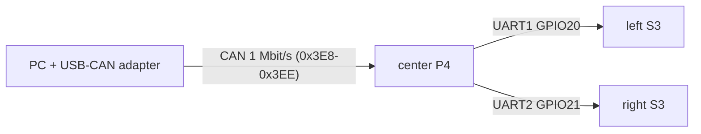

# CAN Node Bench Test Procedure — Celica ST185 TrackCluster

Verify each CAN node in isolation on the bench, before it ever sees the full
vehicle bus, by connecting a USB-CAN adapter to your laptop and injecting (or
monitoring) the exact traffic the node expects in normal operation.

All frame layouts come from [`CAN-BUS-ID-ALLOCATION-TABLE.md`](CAN-BUS-ID-ALLOCATION-TABLE.md).
The tool lives in [`bench/`](bench/) and is driven by
[`bench/can_bench.py`](bench/can_bench.py).

---

## 0. One-time setup

### Hardware
- A USB-CAN adapter:
  - **CANable / slcan** (`/dev/ttyACM0` on Linux, `COMx` on Windows), or
  - **PCAN USB** (`PCAN_USBBUS1`), or
  - any SocketCAN interface on Linux (`can0`).
- Two 120 Ω terminators on the short bench harness — one at the adapter, one at
  the node under test. (A single node + adapter is a 2-end bus; it needs both.)
- 12 V bench supply for the node under test (cluster, switchboard, or Pi).

### Software
```bash
cd bench
python3 -m pip install -r requirements.txt   # installs python-can
```

### Bring the adapter up at 1 Mbit/s
- **SocketCAN (CANable in candleLight/gs_usb mode, or built-in controller):**
  ```bash
  sudo ip link set can0 up type can bitrate 1000000
  ```
  then use `--interface socketcan --channel can0`.
- **slcan (CANable in slcan firmware):** use
  `--interface slcan --channel /dev/ttyACM0 --bitrate 1000000`.
- **PCAN USB:** use `--interface pcan --channel PCAN_USBBUS1 --bitrate 1000000`.

> The examples below use `socketcan/can0`. Swap in your adapter's flags.

### Quick adapter sanity check
With the adapter looped to itself or to any live node:
```bash
python3 can_bench.py --interface socketcan --channel can0 monitor
```
You should see decoded frames (or at minimum raw frames from a live node). Ctrl-C to stop.

---

## 1. The cluster (center P4 + left/right S3)

### How the cluster works on the bus
**Only the center ESP32-P4 is a CAN node.** It decodes the five ECU→Cluster
frames into its dash-data model, then forwards that data to the **left and right
ESP32-S3** side displays over UART (center GPIO20 → left GPIO44, center GPIO21 →
right GPIO44, 921600 8N1). The side boards have **no CAN connection** — they
mirror whatever the center forwards. The right screen also raises the full-screen
ECU warning overlay driven by `0x3EE`.



So to test the **whole cluster**, you inject CAN into the center P4 and watch all
three screens; the side displays validate the center's UART bridge end-to-end.

### 1a. Quick single-board check (center P4 only on the bench)
If you only have the center board wired:
```bash
python3 can_bench.py --interface socketcan --channel can0 simulate-ecu --cluster-only
```
This sweeps every cluster signal at once:

| Frame | ID | Rate | What sweeps |
|---|---|---|---|
| Engine Fast | 0x3E8 | 10 ms | RPM 800→7200, MAP 30→220, ECT/IAT/Oil temps |
| Speed/Press/Ign | 0x3E9 | 10 ms | ign angle, vehicle speed 0→180, oil/fuel press |
| Lambda | 0x3EA | 10 ms | λ 0.78→1.10 |
| Gear/Fuel | 0x3EB | 50 ms | gear cycles N,1-6,R; fuel 0→100 % |
| Engine Protect | 0x3EE | 50 ms | each warning bit pulses in turn |

### 1b. Full cluster test (center P4 → left & right S3) — recommended
Wire all three boards and run the **guided** scenario. It keeps all five cluster
frames flowing (so the center keeps forwarding live snapshots to both sides) but
animates **one signal at a time**, printing what to verify on each screen:
```bash
python3 can_bench.py --interface socketcan --channel can0 full-cluster
# add --loop to repeat until Ctrl-C
```
The 16 phases walk through: idle → RPM/boost → speed → temps → gear → fuel →
lambda → pressures → ignition → each warning bit in turn → clear. Each phase
prints a `CENTER:` and `SIDES:` prompt so you know exactly what to look at.

#### Wiring for the full-cluster test
This is **not** a CAN-only rig — the side displays come up over UART, so:

| Connection | From | To |
|---|---|---|
| CAN | PC adapter CANH/CANL | center P4 transceiver (GPIO5 TX / GPIO4 RX) |
| UART to left | center GPIO20 | left S3 GPIO44 |
| UART to right | center GPIO21 | right S3 GPIO44 |
| Common ground | PC adapter GND + all three boards GND | tied together |
| Power | 5 V (≥3 A) | center J8 pin2, left VIN, right VIN |

- CAN termination: 120 Ω at the PC adapter **and** 120 Ω at the center
  transceiver end (2-device bus = both ends terminated).
- Flash/monitor the side boards over **USB-C**, not GPIO43/44 — those are the S3
  console pins and would fight the inter-cluster UART link.

#### Pass criteria
- [ ] **Center** gauges track every phase smoothly (no freeze/jitter) — confirms 10 ms CAN decode.
- [ ] **Both side screens** update in lockstep with the center (confirms the UART bridge to each S3).
- [ ] Temps read plausible °C (offset −50); gear steps N→1..6→R (raw 7 = R/−1); fuel ramps full↔empty.
- [ ] During the warning phases, the **right screen** raises the full-screen ECU WARNING overlay for each of: knock, ignition cut, fuel cut, boost cut, sensor error, throttle error.
- [ ] Neither side shows stale/blank data when a signal is held steady (idle phases).

### 1c. Confirm cluster TX (button responses)
The center also *transmits* when you press its boost-map / TC encoders. In a
second terminal, monitor while pressing them:
```bash
python3 can_bench.py --interface socketcan --channel can0 monitor --known-only
```
- [ ] Pressing the **boost-map** encoder emits `0x3EC` with the selected index in byte 0.
- [ ] Pressing the **TC** encoder emits `0x3ED` with the selected index in byte 0.

---

## 2. ECUMaster CAN Switch Board V3

The switchboard **generates its own** `0x640`/`0x641`/`0x642` — so the primary
test is to **monitor and decode** them. You only inject to test its `0x643` input.

> Reminder: confirm the board is set to **1000 kbps** and **Base ID 0x640** first
> (see [`ECUMASTER_SWITCHBOARD_SETUP.md`](ECUMASTER_SWITCHBOARD_SETUP.md)). A board
> still at the 500 kbps default will corrupt the bus.

### Monitor its output
```bash
python3 can_bench.py --interface socketcan --channel can0 monitor --known-only
```

### Pass criteria
- [ ] `0x640` and `0x641` appear at ~20 Hz; analog channels read 0–5000 mV and
      track when you change the wired input voltage.
- [ ] `0x642` appears at ~20 Hz; the `heartbeat` field increments every frame and
      wraps 255→0.
- [ ] Toggling a wired switch flips the expected `sw_mask` bit
      (bit0=Evap, bit1=AC Request, bit2=Cruise Active, bit3=Cruise Set, bit4=Cruise Resume).
- [ ] Turning a rotary changes the matching nibble in `rotaries`.

### Test the 0x643 low-side input (optional)
With a low-side output wired to an LED/relay/test lamp:
```bash
# Pulse L1 on for ~1 s (20 frames @ 50 ms):
python3 can_bench.py --interface socketcan --channel can0 \
    inject-ls-command --l1 255 --count 20 --period 0.05
```
- [ ] The corresponding low-side output activates while frames are sent.

### Don't have a real board yet?
Simulate one to validate your monitor/decoder and downstream PCLink config:
```bash
python3 can_bench.py --interface socketcan --channel can0 \
    simulate-switchboard --toggle-switches
```

---

## 3. Raspberry Pi 5 + USB-CAN adapter (RealDash)

RealDash is a **passive listener** of the three ECU→RealDash frames. Feed it the
new streams and watch the dashboard.

### Inject
```bash
# Full ECU output including the RealDash-only frames (default — no --cluster-only):
python3 can_bench.py --interface socketcan --channel can0 simulate-ecu
```

This adds, on top of the cluster frames:

| Frame | ID | Rate | Content |
|---|---|---|---|
| Drive Assist & Status | 0x3EF | 50 ms | target λ, throttle %, TC setting/intervention, boost map, cruise state, AC status |
| Extended Sensors | 0x3F0 | 100 ms | fuel temp, engine load, coolant press, ethanol %, charge-pipe IAT, cabin temp, turbo speed, trigger errors |
| IMU & Ext Warnings | 0x3F1 | 50 ms | accel X/Y/Z (±g), extended-warning bits |

### Pass criteria
- [ ] RealDash CAN connection is at **1 Mbit/s**, `bus="0"`, using the
      [`link_g4x_realdash.xml`](link_g4x_realdash.xml) definitions.
- [ ] 0x3EF gauges move: throttle 0→100 %, cruise/AC state enums cycle, boost-map
      and TC indices change.
- [ ] 0x3F0 gauges read plausible engineering values (temps offset −50; turbo speed
      = raw ×100 RPM).
- [ ] 0x3F1 accel X/Y/Z swing through ± values (scale 0.1 g); extended-warning
      indicators light as each bit pulses, including **bit5 = Switchboard Comm Fault**.

---

## 4. Encoding reference (sanity-check decoded values)

| Field type | Raw → physical | Example |
|---|---|---|
| Temperatures (ECT, IAT, oil, fuel, cabin, charge-pipe) | `°C = raw − 50` | raw 140 = 90 °C |
| Ignition angle (0x3E9) | `deg = raw × 0.1 − 100` | raw 1155 = 15.5° |
| Lambda / target lambda | `λ = raw × 0.001` | raw 950 = 0.950 |
| Accel X/Y/Z (0x3F1) | `g = raw × 0.1` (signed) | raw −12 = −1.2 g |
| Turbo speed (0x3F0) | `RPM = raw × 100` | raw 120 = 12 000 RPM |
| Analog inputs (0x640/1) | raw mV (0–5000) | raw 2500 = 2.50 V |

All multi-byte fields are **BigEndian**.

---

## 5. Command quick reference

```text
python3 can_bench.py [--interface I] [--channel C] [--bitrate B] [-v] <subcommand>

  simulate-ecu [--cluster-only] [--duration S]
  full-cluster [--loop]
  simulate-switchboard [--toggle-switches] [--duration S]
  inject-ls-command [--l1 N --l2 N --l3 N --l4 N] [--count N] [--period S]
  monitor [--known-only]
```

`--bitrate` is ignored for `socketcan` (set it via `ip link`); required for
`slcan`/`pcan`. Defaults: `--interface socketcan --channel can0 --bitrate 1000000`.
