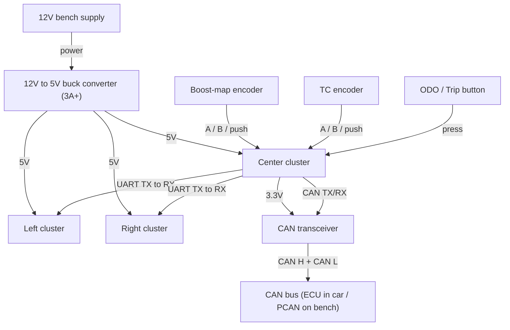

# CAN Node Bench Test Procedure — Celica ST185 TrackCluster

Test the cluster and RealDash on the bench before they go in the car. The tool
lives in [`bench/`](bench/) and is run with [`bench/can_bench.py`](bench/can_bench.py).
Frame layouts come from [`CAN-BUS-ID-ALLOCATION-TABLE.md`](CAN-BUS-ID-ALLOCATION-TABLE.md).

There are two tests:

- The cluster test (center cluster + left and right clusters).
- The RealDash test.

---

## 0. One-time setup

### Adapters
- Use a **PCAN USB** adapter. PCAN units have a **120-ohm terminating resistor
  built in**, so you do not add any external resistors.
- Each PCAN connects to its device with a **USB cable**.
- The tool also works with a CANable/slcan or a Linux SocketCAN interface, but
  the examples below assume PCAN.

### Software
```bash
cd bench
python3 -m pip install -r requirements.txt
```

### Bring the adapter up at 1 Mbit/s
- **PCAN:** pass `--interface pcan --channel PCAN_USBBUS1 --bitrate 1000000`.
- **Linux SocketCAN:** `sudo ip link set can0 up type can bitrate 1000000`, then
  pass `--interface socketcan --channel can0`.

### Quick adapter check
```bash
python3 can_bench.py --interface pcan --channel PCAN_USBBUS1 --bitrate 1000000 monitor
```
You should see frames from any live node. Press Ctrl-C to stop.

---

## 1. Cluster test (center, left, and right clusters)

### How it works
Only the **center cluster** is on the CAN bus. It reads the ECU's CAN frames,
then sends the data to the **left cluster** and **right cluster** over UART. The
side clusters are **receive-only** — they take in data but send nothing back.
The right cluster also shows the full-screen warning overlay.

So to test the whole cluster, you feed CAN into the center cluster and watch all
three screens. If the side screens update, the UART link works.

### Signal wiring (CAN + UART only)
**CAN (two wires):**
- PCAN **CAN H** to CAN transceiver **CAN H**.
- PCAN **CAN L** to CAN transceiver **CAN L**.
- The transceiver connects to the center cluster's CAN pins (GPIO5 = TX, GPIO4 = RX).

**UART (one wire per side, TX to RX):**
- Center cluster **UART1 TX (GPIO20)** to left cluster **RX (GPIO44)**.
- Center cluster **UART2 TX (GPIO21)** to right cluster **RX (GPIO44)**.
- The side clusters are receive-only, so their TX pins are not connected.

Power and ground are covered in the separate Power section below.

> Flash the side clusters over USB-C, not the GPIO43/44 console pins, so the
> console does not fight the UART link.

### Quick check (center cluster only)
```bash
python3 can_bench.py --interface pcan --channel PCAN_USBBUS1 --bitrate 1000000 simulate-ecu --cluster-only
```
This sweeps every cluster value at once.

### Full guided test (recommended)
```bash
python3 can_bench.py --interface pcan --channel PCAN_USBBUS1 --bitrate 1000000 full-cluster
```
Add `--loop` to repeat until Ctrl-C. It walks one value at a time across 16
phases and prints a `CENTER:` and `SIDES:` prompt for each, so you know what to
watch.

### Pass criteria
- [ ] Center screen tracks every phase smoothly.
- [ ] Left and right screens update along with the center (this proves the UART link).
- [ ] Gear steps N → 1..6 → R; fuel ramps full to empty; temps look right.
- [ ] During the warning phases, the right screen raises the warning overlay.
- [ ] No stale or blank data when a value is held steady.

### Confirm center cluster send (encoders)
The center cluster also sends data when you turn its encoders. In a second
terminal:
```bash
python3 can_bench.py --interface pcan --channel PCAN_USBBUS1 --bitrate 1000000 monitor --known-only
```
- [ ] Turning the boost-map encoder sends `0x3EC`.
- [ ] Turning the TC encoder sends `0x3ED`.

---

## 2. RealDash test

### How it works
RealDash only listens. It receives three CAN frames from the ECU and shows them.
It sends nothing.

RealDash reads CAN through its **own** PCAN adapter, so you use two PCAN adapters:

- **PCAN 2** connects to your computer by USB. Your computer runs the tool.
- **PCAN 1** connects to the RealDash device by USB. That device runs RealDash.

This matches the car, where PCAN 1 stays with RealDash.

### Signal wiring (CAN only)
- PCAN 2 **CAN H** to PCAN 1 **CAN H**.
- PCAN 2 **CAN L** to PCAN 1 **CAN L**.
- Both PCAN units have 120-ohm termination built in, so nothing else is needed
  on the bus.

Power is covered in the separate Power section below.

### Run the guided test
```bash
python3 can_bench.py --interface pcan --channel PCAN_USBBUS1 --bitrate 1000000 full-realdash
```
Add `--loop` to repeat. It walks one value at a time across 26 phases and prints
a `REALDASH:` prompt for each. Set RealDash to **1 Mbit/s**, **bus 0**, using
[`link_g4x_realdash.xml`](link_g4x_realdash.xml).

### Pass criteria
- [ ] Each value moves in its own phase.
- [ ] Each warning indicator lights in its phase.
- [ ] No stale or blank gauges when a value is held steady.

---

## 3. Power wiring (kept separate from signals)

Power and ground are wired on their own. They are **not** part of the CAN or
UART signal wiring.

- A **12V to 5V buck converter** (rated 3A or more) feeds **5V** to all three clusters.
- The **CAN transceiver** gets its power from the center cluster's **3.3V** output.
- On the bench, each cluster and the RealDash device can have its own power supply.
- **Tie all the power-supply grounds together.** This one shared ground is also
  the reference the UART signals use. You do not run a separate ground wire just
  for UART.
- The encoder and button commons also connect to this same ground.

---

## 4. Cluster wiring diagram

Power feeds are labeled 5V or 3.3V. Signal wires are labeled CAN or UART. The
encoders and button are inputs to the center cluster.



> All grounds (power supplies, transceiver, encoder and button commons) tie to
> one common ground — see the Power section.

---

## 5. Encoding reference (sanity-check decoded values)

| Field type | Raw to physical | Example |
|---|---|---|
| Temperatures (ECT, IAT, oil, fuel, cabin, charge-pipe) | `°C = raw − 50` | raw 140 = 90 °C |
| Ignition angle (0x3E9) | `deg = raw × 0.1 − 100` | raw 1155 = 15.5° |
| Lambda / target lambda | `λ = raw × 0.001` | raw 950 = 0.950 |
| Accel X/Y/Z (0x3F1) | `g = raw × 0.1` (signed) | raw −12 = −1.2 g |
| Turbo speed (0x3F0) | `RPM = raw × 100` | raw 120 = 12 000 RPM |

All multi-byte fields are **BigEndian**.

---

## 6. Command quick reference

```text
python3 can_bench.py [--interface I] [--channel C] [--bitrate B] [-v] <subcommand>

  simulate-ecu [--cluster-only] [--duration S]
  full-cluster [--loop]
  full-realdash [--loop]
  monitor [--known-only]
```

PCAN example flags: `--interface pcan --channel PCAN_USBBUS1 --bitrate 1000000`.
For SocketCAN, set the bitrate with `ip link` and use
`--interface socketcan --channel can0`.
