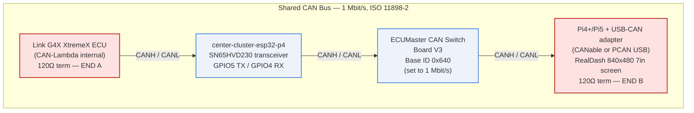

# TrackCluster — Wiring & Pinout (physical install)

**Reference only — NOT flashed.** Lives at the center repo root so it's immediately visible.
Everything below is GPIO/connector-validated against the ESP32-P4 / ESP32-S3
datasheets + errata and the two Waveshare board schematics (June 2026).

Three boards:
- **Center** — Waveshare ESP32-P4-WIFI6-Touch-LCD-XC, 800×800, 40-pin header **J8**.
- **Left / Right** — Waveshare ESP32-S3-Touch-LCD-2.8C, 480×480 (identical boards, different firmware).

---

## 1. Power — 12 V → 5 V buck feeds all three boards

Each board regulates its own 3V3 on-board; **feed them 5 V**, never 3V3 directly.

```
   Vehicle 12 V ──► [12V→5V buck, ≥3 A] ──┬──► Center  5V  (J8 pin 2)   + GND (J8 pin 39)
   (switched/IGN)                          ├──► Left    5V  (5V/VIN pad) + GND
                                           └──► Right   5V  (5V/VIN pad) + GND
```

- **Buck converter:** 12 V in → **5 V** out, **≥3 A** (≈2.5 A peak all-3 with backlights; size up for margin).
  Common ground with the vehicle/ECU.
- **Center 5 V input:** J8 **pin 2 = 5V**, **pin 39 = GND** (or the board's USB-C 5V — but use J8 for the install).
- **Harness drawing:** [`apps/harness-schematic/index.html`](apps/harness-schematic/index.html) (interactive schematic; also at `docs/harness/HARNESS_WIRING_DIAGRAM.html`).
- **Side 5 V input:** each S3 board's **VIN / 5V** pad and **GND** (USB-C VBUS is the same net; the
  PH1.25 2-pin "BAT" connector is for an optional Li-ion only — do not feed 5 V there).
- Add a common-mode choke / 100 µF bulk cap near each board if you see backlight flicker on engine crank.

---

## 2. CAN — ECU ↔ Center (only the center touches CAN)

The ESP32-P4 TWAI controller is logic-level; it needs an **external CAN transceiver**.

```
  Center P4                  CAN transceiver                 Link G4X ECU
  GPIO5 (J8) ──TXD──►        TXD                             CAN bus
  GPIO4 (J8) ◄──RXD──        RXD        CANH ──────────────► CAN Hi
       3V3   ──────►         VCC        CANL ──────────────► CAN Lo
       GND   ──────►         GND        (120 Ω term at each bus end)
```

- **Transceiver:** SN65HVD230 (3.3 V) or isolated ISO1050 / TJA1051T. Power its logic side from the
  center's **3V3**, not 5 V.
- **Waveshare [SN65HVD230 CAN Board](https://www.waveshare.com/sn65hvd230-can-board.htm):** passive
  hardware — **no firmware or programming**. Wire **VCC→3V3**, **GND→GND**, **CTX→GPIO5 (TWAI TX)**,
  **CRX→GPIO4 (TWAI RX)**, **CANH/CANL** to the ECU bus. Supports up to **1 Mbit/s** (matches Link G4X).
  Do not short CANH and CANL.
- **Bus:** 1 Mbit/s, 120 Ω termination at both physical ends of the CAN backbone (one is usually in
  the ECU; add one 120 Ω at the transceiver end if it's the far end).
- ECU broadcast IDs 0x3E8–0x3EB + status 0x3EE; dash→ECU TX 0x3EC/0x3ED. See `link_g4x_can_setup.*`.

---

## 3. Inter-cluster UART — Center → Left, Center → Right

921600 8N1, one direction used (center transmits; side RX lines reserved are optional). Keep runs
short or twisted; common ground required.

```
  Center P4                          Left S3                 Right S3
  GPIO20 (UART1 TX) ───────────────► GPIO44 (RX)
  GPIO18 (UART1 RX, reserved) ◄────  GPIO43 (TX, reserved)
  GPIO21 (UART2 TX) ─────────────────────────────────────►  GPIO44 (RX)
  GPIO19 (UART2 RX, reserved) ◄───────────────────────────  GPIO43 (TX, reserved)
  GND ───────────────────────────────common───────────────  GND
```

- The S3 boards expose **GPIO43/44 on the on-board UART connector** (silk UART_TXD/UART_RXD).
- **Console note:** GPIO43/44 are the S3's default UART0 console pins. Flash/monitor each side board
  over its **USB-C (USB-Serial-JTAG)** so the inter-cluster link stays clean — the firmware build
  already targets the USB console; don't also drive a serial monitor on GPIO43/44.

---

## 4. Buttons & encoders — Center only (active-low to GND)

All inputs use internal pull-ups; wire the common side to **GND**. 44 kΩ… use the chip pull-ups
(no external resistor needed); add 100 nF across each contact for debounce if noisy.

| Control | Signal | Center GPIO (J8) |
|---|---|---|
| Push-button (ODO / Trip) | to GND | **29** |
| Encoder 1 — Boost map | A / CLK | **30** |
| | B / DT | **31** |
| | push (to GND) | **32** |
| Encoder 2 — TC slip | A / CLK | **49** |
| | B / DT | **50** |
| | push (to GND) | **51** |

---

## 5. Full GPIO reference (all three displays)

### Center — ESP32-P4 (J8 40-pin header)
| Function | GPIO | Notes |
|---|---:|---|
| CAN TX → transceiver | 5 | TWAI |
| CAN RX ← transceiver | 4 | TWAI, 1 Mbit/s |
| LCD backlight PWM | 26 | firmware-driven LEDC |
| LCD reset | 27 | panel reset line |
| Shared board I²C SDA | 6 | touch/peripheral bus |
| Shared board I²C SCL | 7 | touch/peripheral bus |
| UART1 TX → Left | 20 | → Left GPIO44 |
| UART1 RX ← Left (reserved) | 18 | |
| UART2 TX → Right | 21 | → Right GPIO44 |
| UART2 RX ← Right (reserved) | 19 | *(was 20 — fixed; 20 collided with UART1 TX)* |
| Button (ODO/Trip) | 29 | active-low |
| Encoder 1 A/B/SW | 30 / 31 / 32 | |
| Encoder 2 A/B/SW | 49 / 50 / 51 | |
| **Reserved — do not use** | 37,38 (PSRAM) · 39–44 (microSD) · 34,35,36 (strapping) · DSI pads | |

### Left & Right — ESP32-S3 (identical)
| Function | GPIO | Notes |
|---|---:|---|
| UART RX ← Center TX | 44 | on UART connector |
| UART TX → Center (reserved) | 43 | on UART connector |
| Shared I²C SCL (TCA9554 + GT911) | 7 | drives panel reset/CS via expander |
| Shared I²C SDA | 15 | |
| **Panel RGB (fixed by board)** | R:46,3,8,18,17 · G:14,13,12,11,10,9 · B:5,45,48,47,21 · PCLK 41 · DE 40 · VSYNC 39 · HSYNC 38 · LCD_SDA 1 · LCD_SCK 2 · BL 6 | hard-wired on the Waveshare board — informational only |
| **Reserved — do not use** | 0,3,45,46 (strapping; 3/45/46 also RGB) · 19,20 (USB) · 26–32 (in-package flash/PSRAM) | |

---

## 6. Validation results (datasheet + errata cross-check)

| Item | Result |
|---|---|
| Center CAN 4/5, buttons 29, encoders 30/31/32/49/50/51 | ✅ all on J8, clear of strapping/PSRAM/USB/microSD |
| Center UART pins | ⚠️ **Fixed:** UART2 RX moved 20 → 19 (GPIO20 was assigned to both UART1 TX and UART2 RX) |
| Center "available" list | ⚠️ Annotated: GPIO34/35/36 are **strapping** pins — removed from the free list in Kconfig |
| Side I²C 7/15 | ✅ free, not strapping/USB/flash |
| Side UART 43/44 | ✅ valid (default UART0 console) — **flash via USB-C** so console doesn't fight the link |
| Side RGB uses strapping GPIO3/45/46 | ✅ acceptable — Waveshare-fixed; panel is idle during boot strap sampling |
| ESP32-S3 GPIO19/20 startup glitch (datasheet) | ✅ N/A — those pins are USB, not used for our I/O |
| Errata (S3 + P4) | ✅ no GPIO-level silicon issues affecting this design (entries are cache/secure-boot/PSRAM) |
| CAN bus now 4 members (ECU, center, switchboard, Pi/RealDash) | ✅ accounted for — see §7. center-cluster-esp32-p4 wiring (GPIO4/5, SN65HVD230) is unchanged by the new nodes |
| CAN bus termination plan (2 physical ends + switchboard jumper) | ⚠️ **Action required at install:** confirm 120Ω only at the two physical bus ends (ECU end + Pi end per §7); switchboard's onboard 120Ω jumper must stay **OFF** unless it physically becomes an end node — do not create a third termination point |

> Pin values here mirror the firmware `Kconfig.projbuild` of each cluster, which remains authoritative.
> If you change a pin in menuconfig, update this table to match.

---

## 7. Shared CAN Bus — Switchboard & RealDash (Pi5)

The CAN bus described in §2 (ECU ↔ Center) has grown into a **4-node shared bus**: Link G4X ECU,
center-cluster-esp32-p4, ECUMaster CAN Switch Board V3, and a Raspberry Pi 5 + Waveshare
dual-MCP2515 hat running RealDash. Full architecture/config rationale lives in
`CAN-BUS-MASTER-DESIGN.md` (§§1-4, §7); byte-level frame layouts live in
`CAN-BUS-ID-ALLOCATION-TABLE.md`. This section covers **physical wiring only** — it does not
replace or duplicate either doc.

§2's ASCII diagram still stands as the one-level-down detail for the ECU↔Center transceiver
wiring (SN65HVD230, GPIO4/5). The diagram below is the **overall bus-topology view**.

### 7.1 Bus topology — 4 nodes, linear daisy-chain



- All four nodes' CANH/CANL pairs are daisy-chained onto the same two-wire bus (1 Mbit/s,
  ISO 11898-2) — per `CAN-BUS-MASTER-DESIGN.md` §2.
- **120 Ω termination lives at the two physical ends of the harness ONLY** — shown above as
  END A (ECU end) and END B (Pi end). **Do not add a third termination point.**
  The diagram's linear left-to-right order (ECU → Center → Switchboard → Pi5) is the
  *logical* bus order for this drawing; the *physical* end nodes are whichever two devices sit
  at the actual harness extremities — confirm against the installed harness, not this diagram's
  layout.

---

### 7.2 ECUMaster CAN Switch Board V3 — wiring

- **Connection:** switchboard CANH/CANL screw terminals → shared bus (daisy-chained per §7.1).
- **Base ID:** 0x640 (factory default — **keep as-is**). Frames 0x640-0x643; see
  `CAN-BUS-ID-ALLOCATION-TABLE.md` §5 for the full byte layout.
- **Critical pre-install step — bit rate:** the switchboard ships at **500 kbps default**. It
  **must be reconfigured to 1000 kbps (1 Mbit/s) via the ECUMaster configuration tool BEFORE
  connecting it to this bus.** This isn't optional: PCLink's "User Stream" ingestion (master
  design §3, §5) requires the switchboard and ECU to be on the same physical bus segment, which
  only works if both run at the same bit rate (1 Mbit/s, matching `link_g4x_can_setup.lcs`
  CANModule Index="1").
- **Onboard 120 Ω termination jumper:** the switchboard has its own termination jumper.
  **Leave it OFF** unless the switchboard physically sits at one of the two bus ends (END A/B
  in §7.1). Enabling it elsewhere creates a third termination point on the bus, which is
  explicitly disallowed (master design §2).

---

### 7.3 Raspberry Pi 4+/Pi5 + USB-CAN Adapter — wiring

**Device:** Raspberry Pi 4+ or Pi5 (verify exact board at install), 840×480 7" touchscreen,
running RealDash.

**NOTE on Waveshare hat:** The Waveshare dual-MCP2515 hat is physically mounted on the Pi for its
cooling fan only. It has **no CAN connections**. Do not wire CANH/CANL to the hat, and do not
configure it in software. Ignore it for all CAN purposes.

**CAN adapter:** USB-CAN adapter (CANable or PCAN USB — confirm exact model at install) plugged
into any Pi USB port.

- **Wiring:** adapter CANH → shared bus CANH; adapter CANL → shared bus CANL; adapter GND →
  chassis/bus GND.
- **Bus speed:** configure the adapter to **1 Mbit/s** (1,000,000 bps) in RealDash connection
  settings — Settings → Connections → Add Connection → CAN Bus → [select adapter] → 1,000,000 bps.
- **Termination:** the Pi is the physical END B of the bus. You MUST provide 120 Ω termination
  here. Options:
  - If using a PCAN USB: enable the onboard termination switch on the adapter body.
  - If using a CANable (no onboard termination): solder a 120 Ω resistor across the CANH/CANL
    terminals on the adapter, or splice it inline at the bus end of the harness.
  - Do NOT use the Waveshare hat's termination for this — the hat is not in the CAN circuit.
- **Role:** passive listener — the Pi does not transmit any CAN frames.

---

### 7.4 Message content — see allocation table

WIRING.md's scope is physical wiring/pinout, not message content. For byte-level frame layouts:

- **0x640-0x643** (switchboard analog inputs, rotaries/switches/heartbeat, low-side output
  control): `CAN-BUS-ID-ALLOCATION-TABLE.md` §5.
- **0x3EF-0x3F1** (new RealDash-only streams — Drive Assist & Status, Extended Sensors, IMU &
  Extended Warnings): `CAN-BUS-ID-ALLOCATION-TABLE.md` §6.
- Full bus topology, speed reconciliation, fault-tolerance, and RealDash/Pi config rationale:
  `CAN-BUS-MASTER-DESIGN.md` §§1-4, §7.
