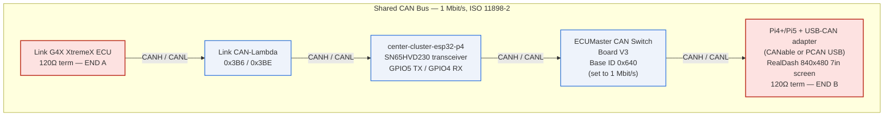

# TrackCluster — Wiring & Pinout (physical install)

**ECU Superseal pinout** (Link G4X XtremeX Connector A/B) lives in
[`XTREMEX-IO-TABLE.html`](XTREMEX-IO-TABLE.html) — that file is the ECU pin
source of truth. This file covers only the **shared CAN bus**: the ECU's CAN
interface and every node hanging off it.

> **Cluster GPIO is NOT here any more.** The center cluster's J8 pinout,
> encoders, buttons, inter-cluster UART and board power moved out on 2026-09-24
> to where they belong: **`center-cluster-esp32-p4`** — `PINOUT.md` and
> `main/Kconfig.projbuild` are authoritative for those, and this repo's copy had
> gone stale (it still reserved GPIO18/19 as center UART RX and knew nothing of
> Encoder 3 or the headlight sense input). See
> `center-cluster-esp32-p4/docs/RECONCILIATION-FROM-ST185-2026-09-24.md`.
>
> The center cluster is a **node on the CAN bus** described below. That
> interface is this repo's; everything inside the cluster is not.


**ECU Superseal pinout** (Link G4X XtremeX Connector A/B) lives in [`XTREMEX-IO-TABLE.html`](XTREMEX-IO-TABLE.html). Pin numbers were confirmed 2026-09-11 against the official [XtremeX Quick Start Guide](https://linkecu.com/documentation/XtremeXQuickstartGuide.pdf) — see `docs/XTREMEX-IO-VERIFY-2026-09-11.md`. This file covers the shared CAN bus only — not ECU cavity numbers, and no longer cluster GPIO.

Three boards:
- **Center** — Waveshare ESP32-P4-WIFI6-Touch-LCD-XC, 800×800, 40-pin header **J8**.
- **Left / Right** — Waveshare ESP32-S3-Touch-LCD-2.8C, 480×480 (identical boards, different firmware).

---

## 2. CAN — ECU ↔ Center (only the center touches CAN)

The ESP32-P4 TWAI controller is logic-level; it needs an **external CAN transceiver**.

```
  Center P4                  CAN transceiver                 Link G4X ECU
  GPIO5 (J8) ──TXD──►        TXD                             CAN bus
  GPIO4 (J8) ◄──RXD──        RXD        CANH ──────────────► CAN Hi
       3V3   ──────►         VCC        CANL ──────────────► CAN Lo
       GND   ──────►         GND        (120 Ω term at each bus end)
```

- **Transceiver:** SN65HVD230 (3.3 V) or isolated ISO1050 / TJA1051T. Power its logic side from the
  center's **3V3**, not 5 V.
- **Waveshare [SN65HVD230 CAN Board](https://www.waveshare.com/sn65hvd230-can-board.htm):** passive
  hardware — **no firmware or programming**. Wire **VCC→3V3**, **GND→GND**, **CTX→GPIO5 (TWAI TX)**,
  **CRX→GPIO4 (TWAI RX)**, **CANH/CANL** to the ECU bus. Supports up to **1 Mbit/s** (matches Link G4X).
  Do not short CANH and CANL.
- **Bus:** 1 Mbit/s, 120 Ω termination at both physical ends of the CAN backbone (one is usually in
  the ECU; add one 120 Ω at the transceiver end if it's the far end).
- ECU broadcast IDs 0x3E8–0x3EB + status 0x3EE; dash→ECU TX 0x3EC/0x3ED. See `link_g4x_can_setup.*`.

---

## 7. Shared CAN Bus — Switchboard & RealDash (Pi5)

The CAN bus described in §2 (ECU ↔ Center) is a **5-node shared bus**: Link G4X ECU,
external Link CAN-Lambda, center-cluster-esp32-p4, ECUMaster CAN Switch Board V3, and a
Raspberry Pi 5 + USB-CAN adapter running RealDash. The Waveshare dual-MCP2515 hat on the
Pi is cooling only — not a bus node. Full architecture/config rationale lives in
`CAN-BUS-MASTER-DESIGN.md` (§§1-4, §7); byte-level frame layouts live in
`CAN-BUS-ID-ALLOCATION-TABLE.md`. This section covers **physical wiring only** — it does not
replace or duplicate either doc.

§2's ASCII diagram still stands as the one-level-down detail for the ECU↔Center transceiver
wiring (SN65HVD230, GPIO4/5). The diagram below is the **overall bus-topology view**.

### 7.1 Bus topology — 5 nodes, linear daisy-chain



- All five nodes' CANH/CANL pairs are daisy-chained onto the same two-wire bus (1 Mbit/s,
  ISO 11898-2) — per `CAN-BUS-MASTER-DESIGN.md` §2.
- **120 Ω termination lives at the two physical ends of the harness ONLY** — shown above as
  END A (ECU end) and END B (Pi end). **Do not add a third termination point.**
  The diagram's linear left-to-right order (ECU → CAN-Lambda → Center → Switchboard → Pi5) is the
  *logical* bus order for this drawing; the *physical* end nodes are whichever two devices sit
  at the actual harness extremities — confirm against the installed harness, not this diagram's
  layout.

---

### 7.2 ECUMaster CAN Switch Board V3 — wiring

- **Connection:** switchboard CANH/CANL screw terminals → shared bus (daisy-chained per §7.1).
- **Base ID:** 0x640 (factory default — **keep as-is**). Frames 0x640-0x643; see
  `CAN-BUS-ID-ALLOCATION-TABLE.md` §5 for the full byte layout.
- **Critical pre-install step — bit rate:** the switchboard ships at **500 kbps default**. It
  **must be reconfigured to 1000 kbps (1 Mbit/s) via the ECUMaster configuration tool BEFORE
  connecting it to this bus.** This isn't optional: PCLink's "User Stream" ingestion (master
  design §3, §5) requires the switchboard and ECU to be on the same physical bus segment, which
  only works if both run at the same bit rate (1 Mbit/s, matching `link_g4x_can_setup.lcs`
  CANModule Index="1").
- **Onboard 120 Ω termination jumper:** the switchboard has its own termination jumper.
  **Leave it OFF** unless the switchboard physically sits at one of the two bus ends (END A/B
  in §7.1). Enabling it elsewhere creates a third termination point on the bus, which is
  explicitly disallowed (master design §2).

---

### 7.3 Raspberry Pi 4+/Pi5 + USB-CAN Adapter — wiring

**Device:** Raspberry Pi 4+ or Pi5 (verify exact board at install), 840×480 7" touchscreen,
running RealDash.

**NOTE on Waveshare hat:** The Waveshare dual-MCP2515 hat is physically mounted on the Pi for its
cooling fan only. It has **no CAN connections**. Do not wire CANH/CANL to the hat, and do not
configure it in software. Ignore it for all CAN purposes.

**CAN adapter:** USB-CAN adapter (CANable or PCAN USB — confirm exact model at install) plugged
into any Pi USB port.

- **Wiring:** adapter CANH → shared bus CANH; adapter CANL → shared bus CANL; adapter GND →
  chassis/bus GND.
- **Bus speed:** configure the adapter to **1 Mbit/s** (1,000,000 bps) in RealDash connection
  settings — Settings → Connections → Add Connection → CAN Bus → [select adapter] → 1,000,000 bps.
- **Termination:** the Pi is the physical END B of the bus. You MUST provide 120 Ω termination
  here. Options:
  - If using a PCAN USB: enable the onboard termination switch on the adapter body.
  - If using a CANable (no onboard termination): solder a 120 Ω resistor across the CANH/CANL
    terminals on the adapter, or splice it inline at the bus end of the harness.
  - Do NOT use the Waveshare hat's termination for this — the hat is not in the CAN circuit.
- **Role:** passive listener — the Pi does not transmit any CAN frames.

---

### 7.4 Message content — see allocation table

WIRING.md's scope is physical wiring/pinout, not message content. For byte-level frame layouts:

- **0x640-0x643** (switchboard analog inputs, rotaries/switches/heartbeat, low-side output
  control): `CAN-BUS-ID-ALLOCATION-TABLE.md` §5.
- **0x3EF-0x3F1** (new RealDash-only streams — Drive Assist & Status, Extended Sensors, IMU &
  Extended Warnings): `CAN-BUS-ID-ALLOCATION-TABLE.md` §6.
- Full bus topology, speed reconciliation, fault-tolerance, and RealDash/Pi config rationale:
  `CAN-BUS-MASTER-DESIGN.md` §§1-4, §7.
