# Engine-room power redistribution — 1993 ST185 All-Trac

**Decision:** keep the OEM engine-room, cowl and dash looms. Do **not** redraw factory harness C. Add a partial Engine Room Harness C for new / upgraded devices only, and inject power and ground at the factory kick-panel junction blocks plus the vacated J/B No.2 connector cavities.

This is the living splice table. Pin facts come from the 1990 ST185 All-Trac EWD (the All-Trac-specific book) cross-checked against the 1992 Celica EWD132U (covers ST185, year-adjacent to 1993). The 1993 bound book is EWD160U; the freely available PDF of that number is the FWD AT180/ST184 book, so it is **not** used as All-Trac pin authority.

Factory snips live in `docs/electrical/ewd-snips/`. The partial drawing is `docs/harness/ST185-EngineRoom-C.harness`. Cabin ECU power stays in `ST185-Power.harness`.

---

## 1. Recommendation

Two ways were on the table:

| | Keep OEM looms + splice table | Fully redraw engine-room C |
|---|---|---|
| Kick-panel J/B No.1, R/B 2/3/4 | Stay. Their internal buses, fuses and relays are why we keep them. | Would have to clone those internals in the kick panels. There is not room. |
| Engine-room main, cowl, dash | Intact except deleted ABS / crash-sensor wires and the new add-on runs. | Hundreds of OEM cavities, colours and splices to reverse-engineer. |
| New EPS, big fans, trunk battery, 160 A alt | Partial C drawing + heavy-DC RADLOK. | Same work, plus the OEM clone. |
| Risk | Miss a J/B2 output pin — caught by the table and an on-car continuity check. | Silent omission of an OEM lighting / wiper / horn circuit. |

**Keep the OEM looms.** Engine Room C is a partial add-on, the same way looms A and B were drawn: only the wires we add.

That also matches the already-written split in `docs/HARNESS-CONSOLIDATION-AND-LAYOUT-PLAN.md` §6.1, with three refinements from this pass:

1. Battery moves to the **trunk**, not the passenger footwell. Cables run forward to a glove-box PDB.
2. The relocated fuse block, PMU-16 and the relays the PMU cannot replace sit in the **passenger glove box**, next to OEM R/B No.3 / No.4 (right kick).
3. EPS power uses the vacated **passenger-side ABS actuator** path, not a third HDP20 bulkhead. `bh_c` stays deleted. Large cables (battery / starter / alternator charge) still cross the firewall on **RADLOK**.

---

## 2. How factory power works today

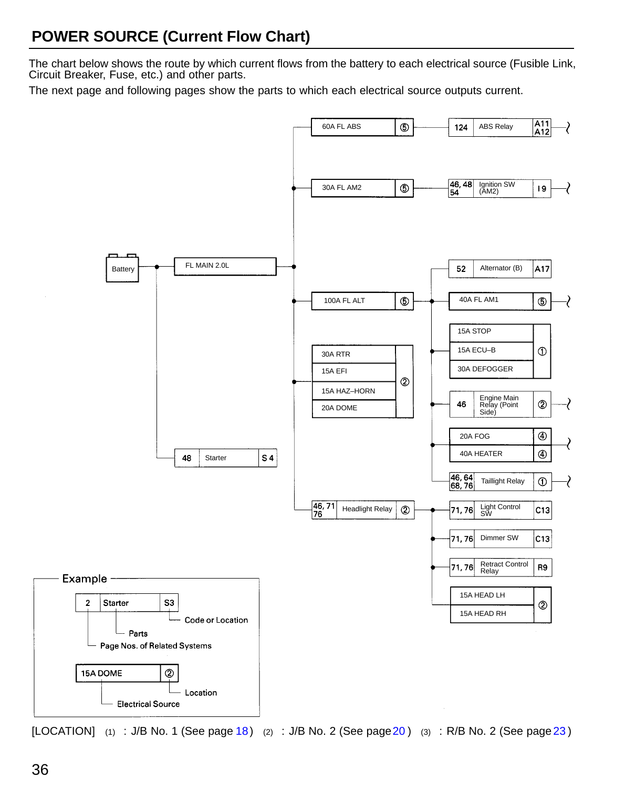

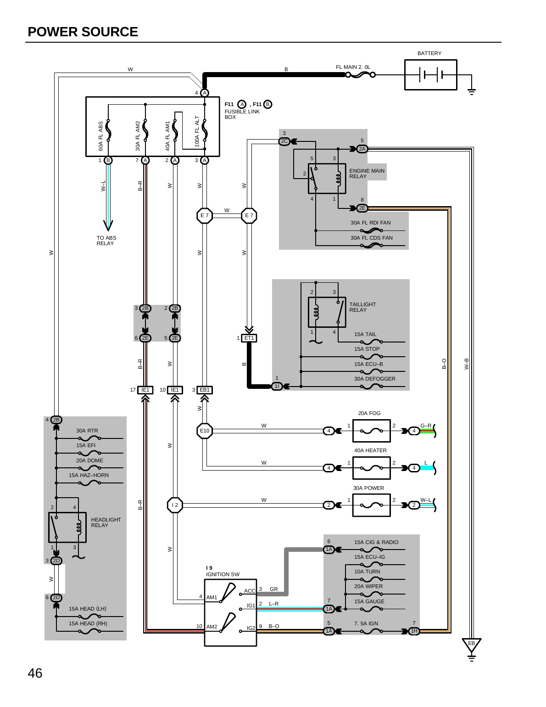

Battery (engine bay, near J/B No.2) → fusible-link box **F11** → J/B No.2 (engine bay, passenger side near the battery) → engine-room main wire, out both fenders:

| Code | What it joins | Where |
|---|---|---|
| **EA1** | Cowl ↔ engine-room main | Front of **right** front fender (passenger) |
| **IE1** | Engine-room main ↔ cowl | **Left** kick panel (driver) |
| **ID1** | Engine-room main ↔ floor | Left kick panel |
| **ET1** | Engine-room main ↔ engine wire | Near J/B No.2 |
| **EB1 / EB2** | Engine wire ↔ cowl | Rear of right front fender |
| **1H / 1I** | Engine-room main ↔ **J/B No.1** | Left kick panel |
| **2A / 2D / 2E** | Engine-room main ↔ **J/B No.2** | At the battery fuse box |
| **2B / 2C** | Engine wire ↔ J/B No.2 | Same place |

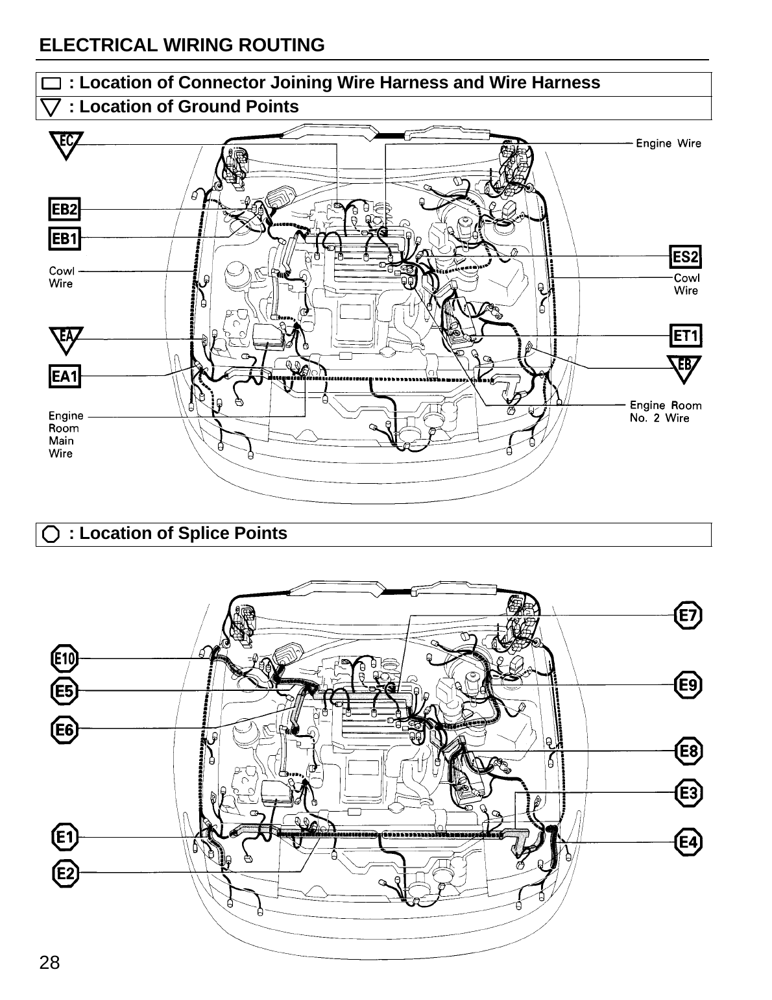

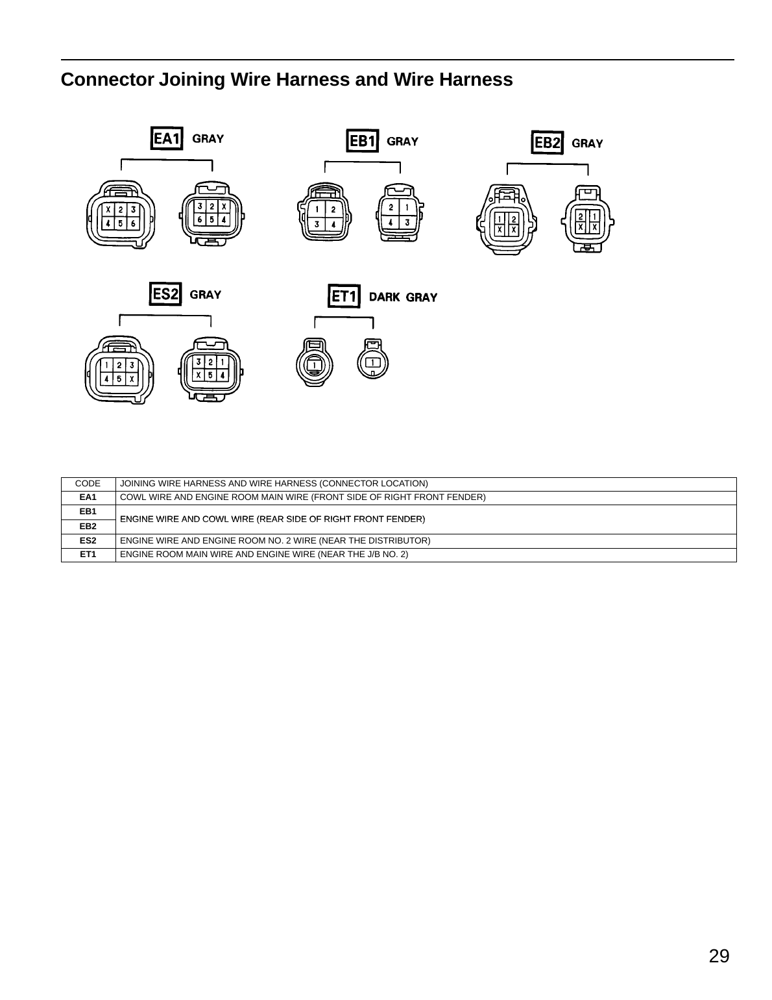

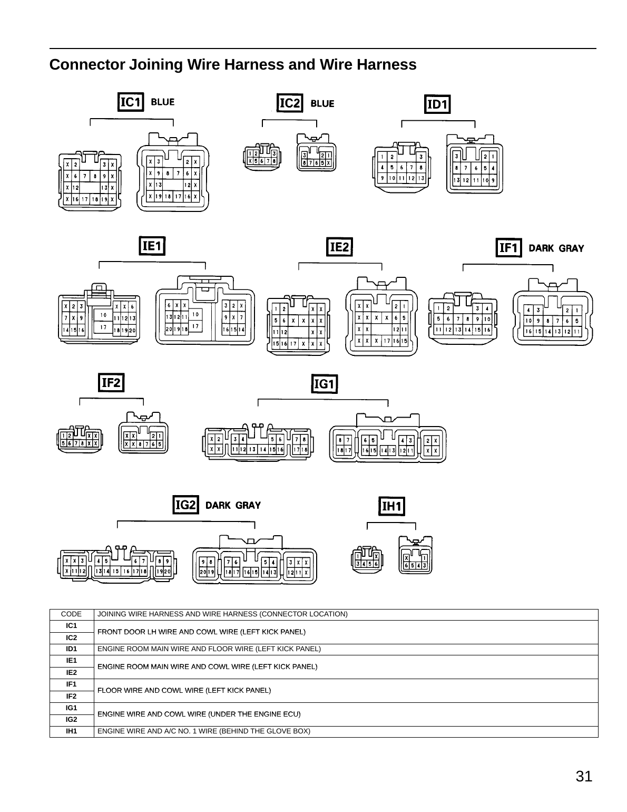

J/B No.2 is the box we are physically removing from the bay. Everything downstream of it — lights, horn, dome, retract, AM1/AM2, the always-hot feed into J/B No.1 — goes dead unless we put those volts back at the **same cavities**, or at the kick-panel end of the same wires.

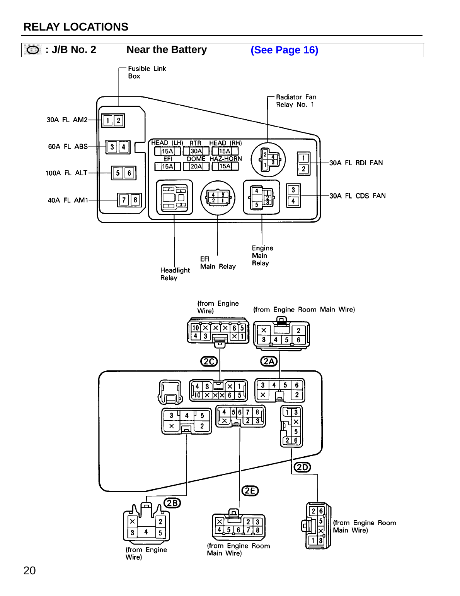

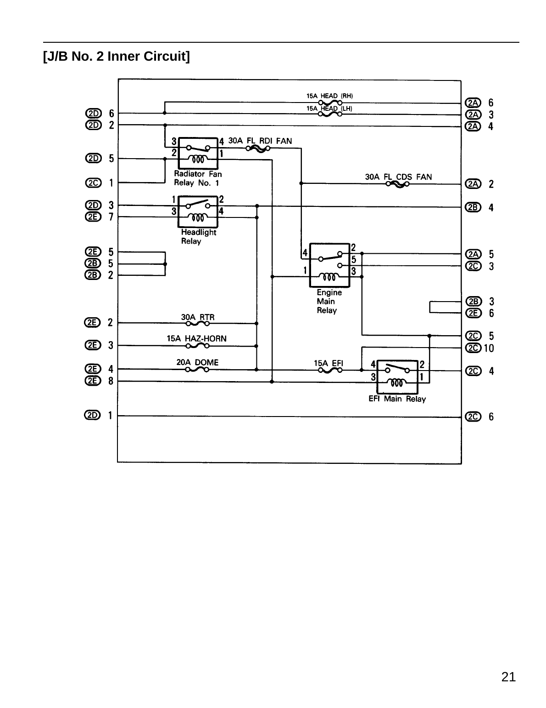

---

## 3. Target architecture

```
TRUNK battery +  ──2 AWG / 1/0──►  GLOVE BOX PDB  ─┬─► TE 2141029-1 fuse block (ECU / pump / EPS / fans)
                     jump lug                     ├─► PMU-16 M6 stud (body / lighting overflow)
TRUNK battery −  ──2 AWG / 1/0──►  PDB ground     ├─► always-hot + AM1 + AM2 to kick-panel J/Bs
                                                  └─► RADLOK +  ──firewall──► starter B+ ◄── 160 A alt B+
                                                     RADLOK −  ──firewall──► engine block
                                                     engine-bay jump post on the starter B+ net
```

Glove box is passenger side, so R/B No.3 and R/B No.4 are a short hop. J/B No.1 and R/B No.2 are the driver kick — a dash-cross of fused feeds, not a second battery cable.

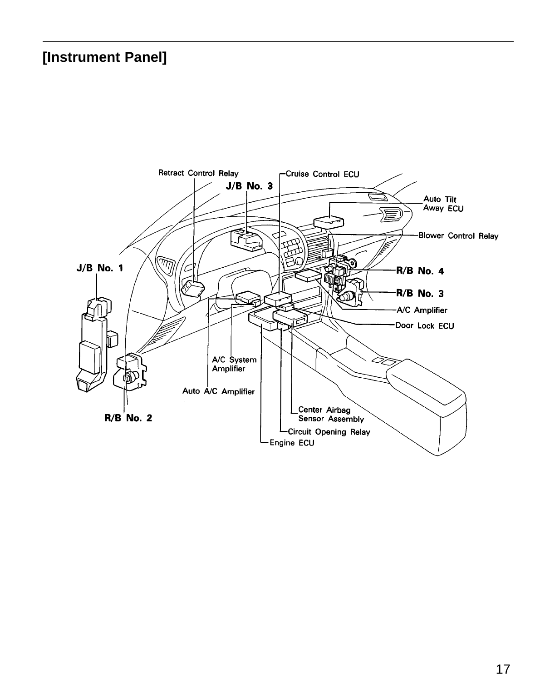

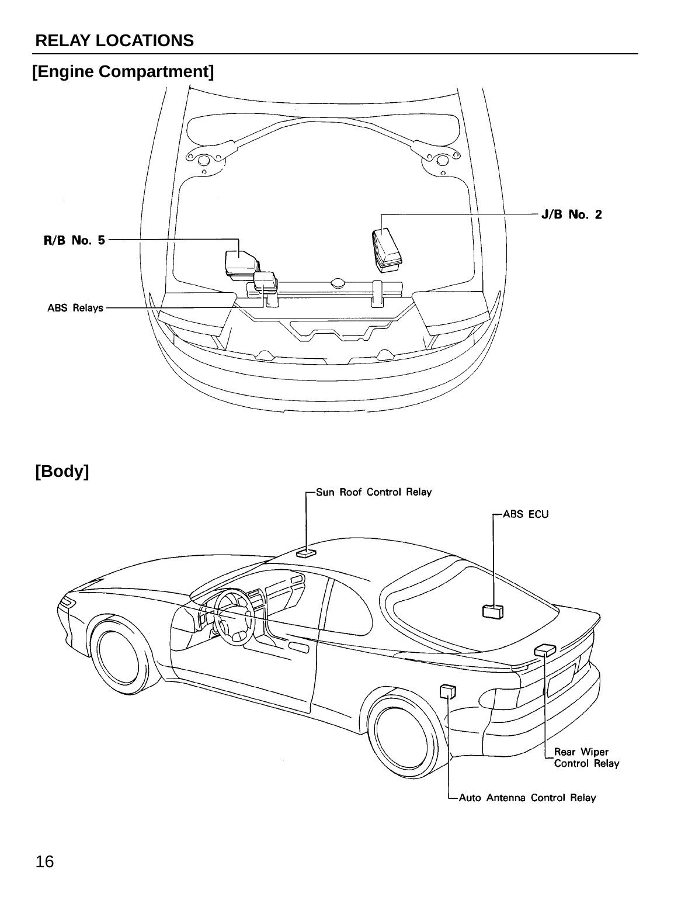

### 3.1 What the PMU-16 can and cannot take

ECUMaster PMU-16: **10 × 25 A** + **6 × 15 A** high-side, **150 A** total, outputs of the same rating may be paralleled (max three → 75 A). Connector terminals are the real limit (Sicma 2.8 ≈ 25 A). On CAN 1 at 1 Mbit/s; do not add a third 120 Ω terminator.

Rule from §6.2 still holds: a load is **either** a PMU output **or** a relay+fuse, never both.

| Load | Path | Why |
|---|---|---|
| Starter motor | Battery cable + RADLOK + existing `k_str` for solenoid | Cranking amps, not a PMU job |
| 160 A alternator B+ | 4 AWG (or 2 AWG) to starter B+, does not recross | Already in Power |
| MRS EPS pump | `k_eps` HCR 150, F7 60 A | >25 A; three paralleled PMU pins would burn three of sixteen channels |
| Uprated rad / condenser fans | `k_fan` / `k_fan2`, fuse sized to the fan's peak | Same; PWM later can still be the relay coil from Aux 5 / Ign 5 |
| EFI main, ETB, fuel pump | Cabin relays in `ST185-Power.harness` | Hold-power and Link's published ETB circuit |
| HEAD LH / HEAD RH | PMU O1 / O2 (25 A) into J/B2 2A-3 / 2A-6 | Replaces 15 A HEAD fuses in J/B2 |
| HAZ-HORN | PMU O3 into 2E-3 | Replaces 15 A HAZ-HORN |
| DOME | PMU O4 (25 A channel) into 2E-4 | Replaces 20 A DOME |
| Retract motors | PMU O5 into 2E-2 | Replaces 30 A RTR; confirm inrush on the car |
| Heater blower | Keep 40 A fuse in **R/B No.4** | 40 A > 25 A and the OEM fuse/relay already sit at the right kick |
| Power windows / locks | Keep 30 A POWER in **R/B No.2** | Same reason, driver kick |
| Wiper, gauge, turn, CIG, ECU-IG, IGN, STOP, TAIL, ECU-B, DEFOGGER | Stay as **J/B No.1** fuses | That is why the J/B stays. We only restore its upstream B+ and IG |
| A/C compressor | Engine harness A/B (already drawn) | Not engine-room C |
| ABS actuator / ABS relays / 60 A FL ABS | **Deleted** | Solenoid module removed |
| Crash / SRS sensors | **Deleted** | Do not refeed the airbag IGN circuit |

PMU therefore uses five body channels plus ignition-switched enable, and still has headroom. It does not replace the kick-panel J/Bs.

---

## 4. Method — unplug J/B No.2, inject at both ends of the engine-room main

1. Disconnect the battery (once it still lives in the bay) and **unplug J/B No.2 connectors 2A, 2B, 2C, 2D, 2E** and fusible-link box **F11**. Remove the ABS actuator, ABS relays, and crash-sensor connectors. Leave the engine-room main, cowl and dash looms in the car.
2. Build the glove-box PDB + fuse block + PMU + remaining relays.
3. Restore **always-hot** into J/B No.1 at **1I pin 1** (left kick). That is the bus behind 15A STOP, 15A ECU-B, 30A DEFOGGER and the taillight-relay battery side.
4. Restore **AM1** and **AM2** at **IE1 pins 10 and 17** (left kick, engine-room main ↔ cowl). Those two wires are the ignition-switch supply. From the starting diagram they already pass IE1 on the way from F11 to I9.
5. Restore lighting / horn / dome / retract at the **vacated 2A / 2D / 2E cavities** with a short jumper harness from the glove box, routed with the passenger-side engine-room main (EA1 / ABS trough).
6. Feed R/B No.4 heater fuse (right kick, next to the glove box) and R/B No.2 POWER fuse (left kick) with always-hot from the PDB.
7. Do **not** refeed 2B / 2C EFI, engine-main-relay-to-OEM-ECU, or circuit-opening-relay pins. Link owns those circuits in the Power file.
8. Continuity-check every row in §5 on the car before first power-up. Toyota pin numbering is wire-side vs device-side in places; the cavity drawings below win over this table if they disagree on the car.

---

## 5. Splice / feed table

Wire colours are Toyota EWD codes: **W** white, **B** black, **B–R** black with red stripe, **B–O** black with orange, **L–R** blue with red, **GR** grey, **W–B** white with black (ground).

### 5.1 Heavy DC (trunk → glove box → bay)

| # | Net | AWG | From | To | Hardware | Notes |
|---|---|---|---|---|---|---|
| H1 | Battery + | 2 AWG (1/0 if the 160 A alt is to run at rating) | Trunk battery + post, jump lug | Glove-box PDB BAT+ stud, jump lug | Cable along cabin floor / tunnel | Replaces engine-bay battery + F11 FL MAIN 2.0L |
| H2 | Battery − | same | Trunk battery − , jump lug | PDB ground + body | Bond to the cargo floor | Separate from sensor Gnd Out |
| H3 | Charge / start + | 2 AWG | PDB ALT/STR stud | RADLOK + firewall (red RL00571-35) | Already owned in the buy list | |
| H4 | Charge / start + | 2 AWG | RADLOK + engine | Starter B+ post, jump lug | | |
| H5 | Alternator B+ | 4 AWG min; 2 AWG preferred at 160 A | Alternator B+ (rear of block, under intake) | Starter B+ | Does **not** recross the firewall | Factory A17 pin B is W; we replace that cable |
| H6 | Engine ground | 2 AWG | RADLOK − engine (black RL00571-35) | Engine block stud, jump lug | OEM grounds EA / EB / EC stay | |
| H7 | Cabin ground | 2 AWG | PDB ground | Kick-panel ground **ID** (left) and a new glove-box ground near R/B4 | | |
| H8 | Jump post | 2 AWG | Starter B+ | Engine-bay jump post | So you can still jump-start from the bay | |

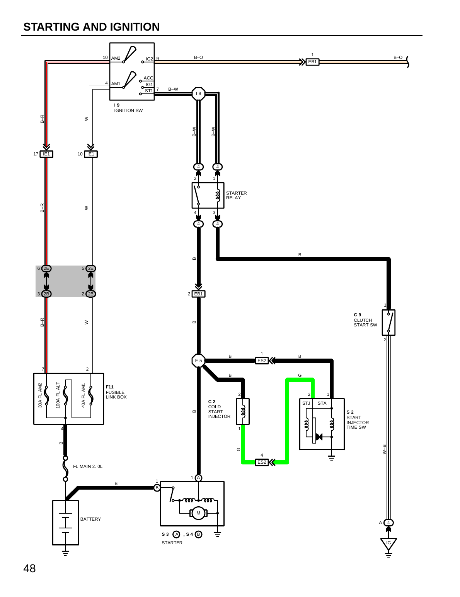

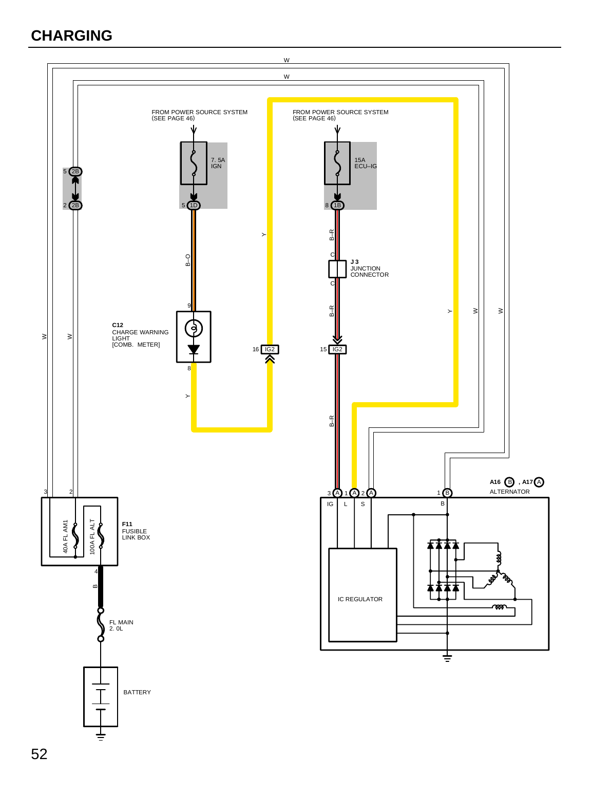

**160 A vs 5.7 mm RADLOK:** RL00571-35 is specified in this repo for 2 AWG / 25 mm². That is enough for cranking (short duty). A 160 A continuous charge path is happier on 1/0 (53 mm²) and an 8 mm RADLOK. Do not order a second 5.7 mm pair for the alt until that is decided; the alt already lands on the starter post.

### 5.2 Left kick panel — J/B No.1 (keep)

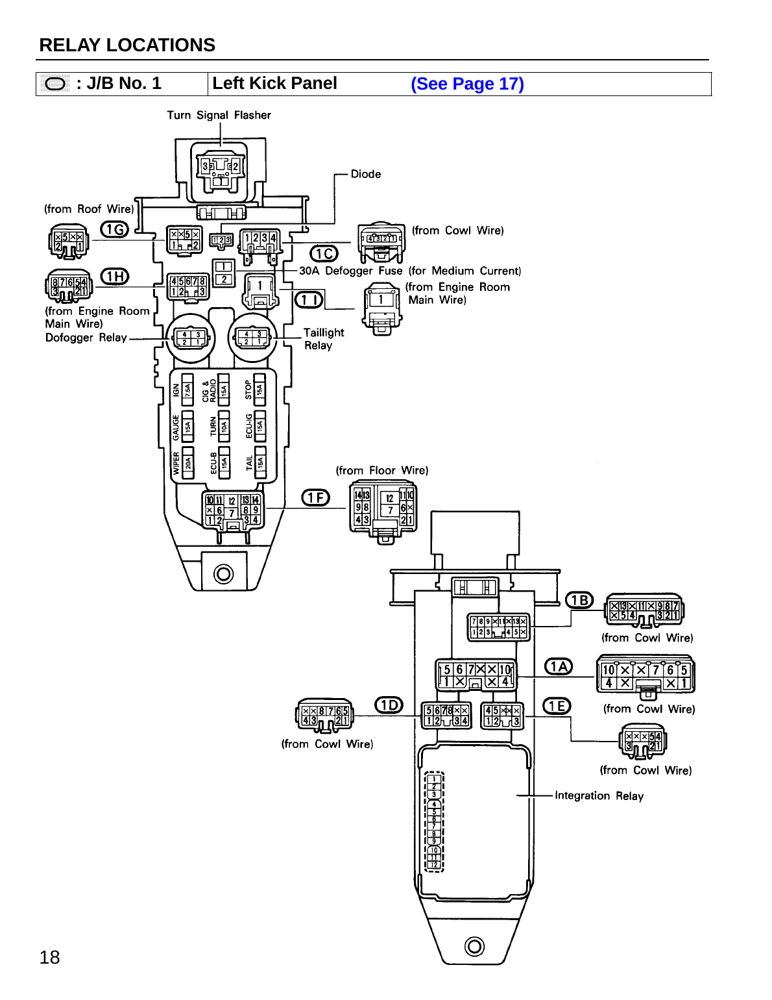

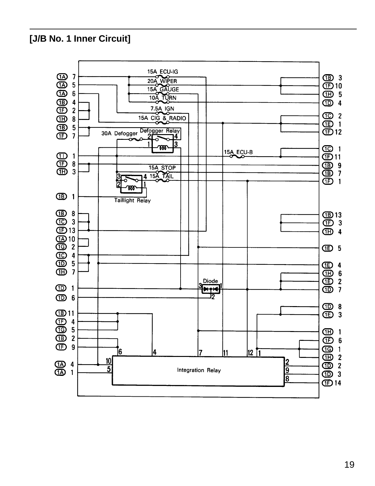

J/B No.1 already contains: 15A ECU-IG, 20A WIPER, 15A GAUGE, 10A TURN, 7.5A IGN, 15A CIG & RADIO, 15A STOP, 15A ECU-B, 15A TAIL, 30A DEFOGGER, taillight relay, defogger relay, turn flasher, integration relay.

| # | Inject? | Connector | Pin | Colour (factory) | Signal | New source | Action |
|---|---|---|---|---|---|---|---|
| L1 | **YES** | **1I** (engine-room main) | **1** | B | Always-hot into J/B1 (STOP / ECU-B / DEFOGGER / tail-relay B+) | PDB OEM HOT, fused 40–60 A upstream of the J/B fuses | Primary left-kick B+. Probe 1I-1 to battery + on the stock car to confirm before cutting |
| L2 | no | **1H** | **7** | B–O | IG2 from ignition switch I9-9 | I9 still feeds it via cowl | Do not overlay. Comes alive once AM2 is restored |
| L3 | maybe | **1H** | **8** | (always-hot family) | Tied to 1I-1 / 1F-8 / 1I-3 on the inner circuit | Follows L1 if the inner bus is intact | Only add a second feed if L1 does not light 1H-8 |
| L4 | no | **1A** | **7** | GR | ACC from I9-3 | Ignition switch | Restored by AM1 (L6) |
| L5 | no | **1A** | **5** | L–R | IG1 from I9-2 | Ignition switch | Restored by AM1 (L6) |
| L6 | **YES** | **IE1** (ER main ↔ cowl, left kick) | **10** | W | AM1 to ignition I9-4 | PDB AM1, **40 A** fuse (replaces F11 40A FL AM1) | Feeds the switch **and** backfeeds engine-room AM1 toward unplugged 2E-5 |
| L7 | **YES** | **IE1** | **17** | B–R | AM2 to ignition I9-10 | PDB AM2, **30 A** fuse (replaces F11 30A FL AM2) | Same, toward 2E-3 |
| L8 | **YES** | Ground **ID** | stud | W–B | Left kick body ground | PDB ground strap | See grounds, EWD p.169 |
| L9 | **YES** | **R/B No.2** 30A POWER fuse | pins 1–2 (housing EWD p.23) | W | Power-window / lock battery | PDB, 30 A already in the R/B — feed the fuse **input** only | Left kick |

Do not land new wires on 1A/1B/1C/1D/1E/1F/1G unless a circuit is dead after L1/L6/L7. Those cavities are cowl / floor / roof, still OEM.

### 5.3 Right kick panel — R/B No.3 / No.4 (keep, next to the glove box)

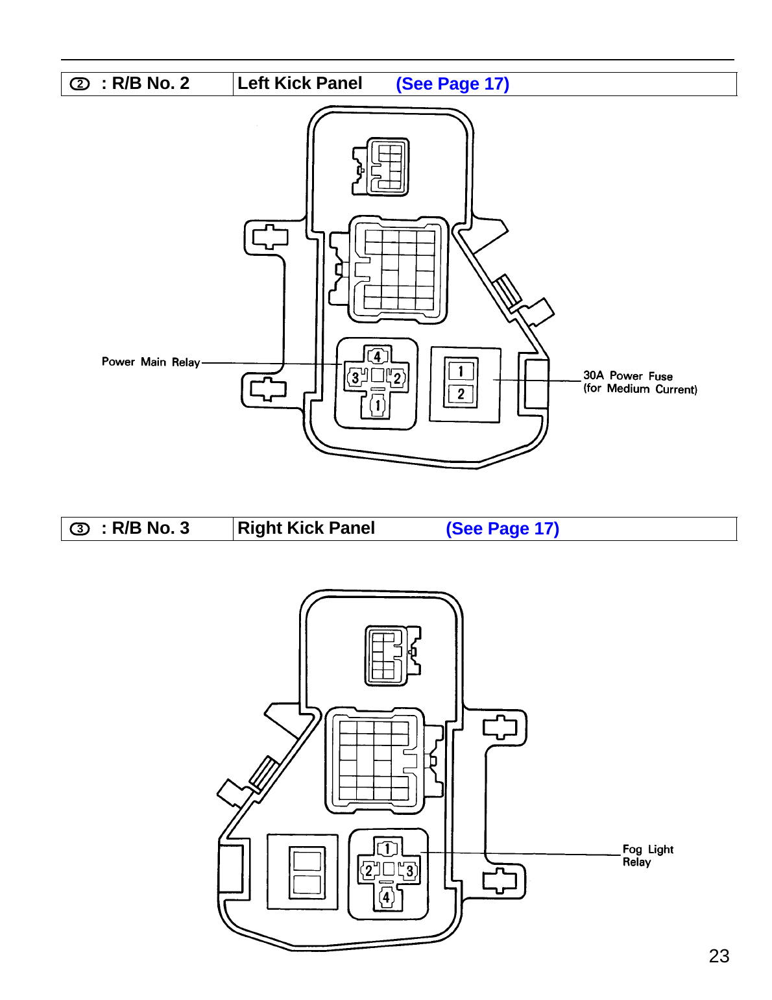

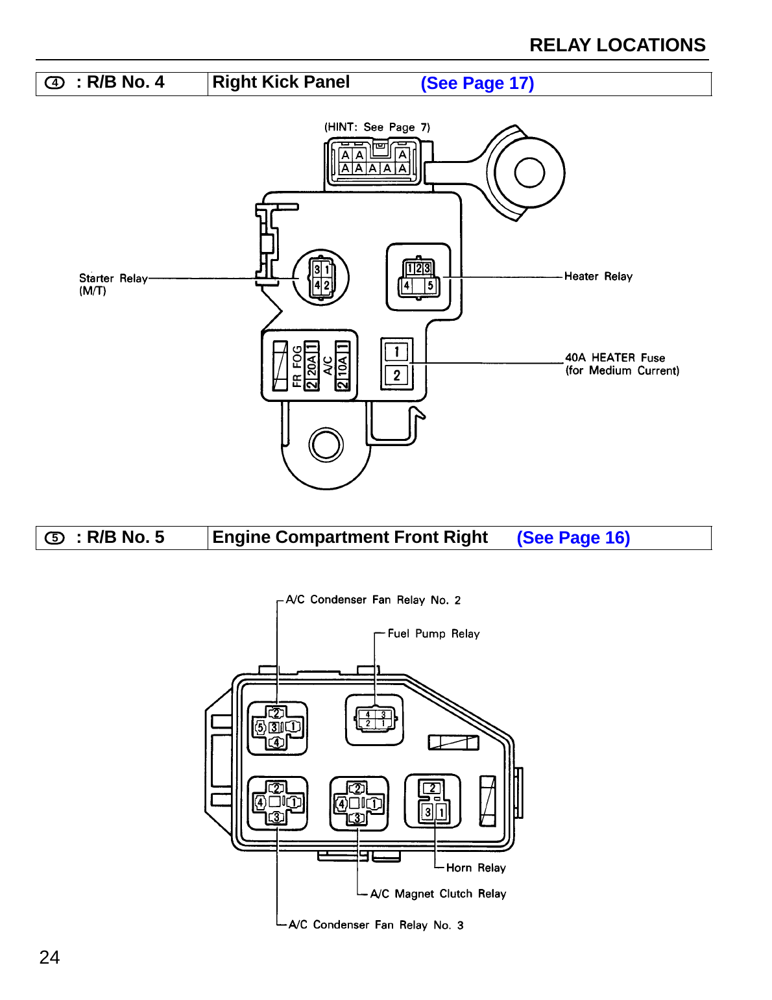

| # | Inject? | Connector | Pin | Signal | New source | Action |
|---|---|---|---|---|---|---|
| R1 | **YES** | **R/B No.4** 40A HEATER fuse | input (housing pins 1–2) | Heater / blower battery | PDB, short run | Keep the OEM 40A fuse and heater relay |
| R2 | isolate | **R/B No.4** starter relay | 30 / 87 | OEM starter | Link `k_str` in the Power file | Unplug or tape the OEM relay. Do not parallel two starter relays |
| R3 | keep | **R/B No.4** 10A A/C, 20A FR FOG | as-is | Fog / A/C amp | Follows R1 if they share the R/B hot bus; otherwise feed from PMU | Fog is optional |
| R4 | keep | **R/B No.3** fog-light relay | coil / 30 | Fog | Only if fog lights stay | |
| R5 | **YES** | New ground near R/B4 set bolt (OEM **IG** is the R/B4 set bolt) | stud | W–B | PDB ground | EWD ground index p.171 |

J/B No.3 (behind the combination meter) is a **cowl junction only** — GR, W–B, W–G, R–L, G, L–Y buses. It does not need a new battery feed. Do not splice it.

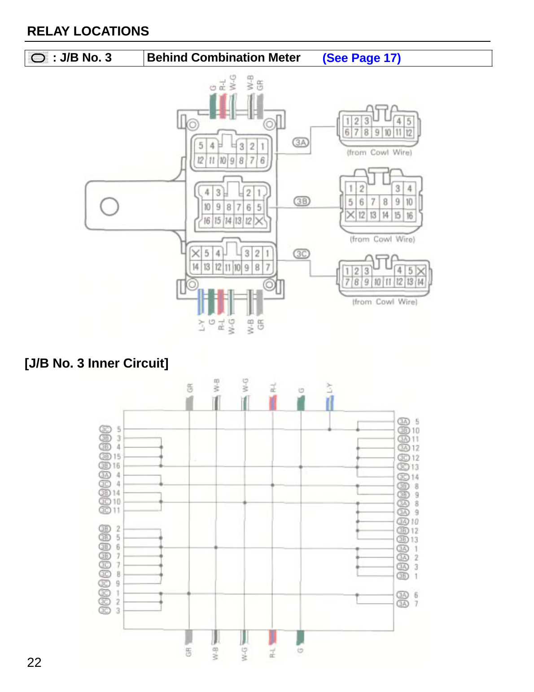

### 5.4 Vacated J/B No.2 cavities (passenger bay, engine-room main)

Make a **J/B2 dummy header**: the mating plugs that used to snap onto J/B No.2, wired back to the glove box along the passenger fender (ABS trough + EA1). Only the pins below are populated. Tape or cavity-plug the rest.

| # | J/B2 cavity | Factory job | New source | Populate? |
|---|---|---|---|---|
| J1 | **2A-3** / **2D-2** | 15A HEAD LH | PMU O1 | **YES** |
| J2 | **2A-6** / **2D-6** | 15A HEAD RH | PMU O2 | **YES** |
| J3 | **2E-2** | Inner cct: 30A RTR. Starting p.48: AM1 with 2E-5 | PMU O5 **only if probe fails AM1** | **PROBE** — see §5.4.1 |
| J4 | **2E-3** | Inner cct: 15A HAZ-HORN. Starting p.48: AM2 with 2E-6 | PMU O3 **only if probe fails AM2** | **PROBE** — horn fallback is R/B5 |
| J5 | **2E-4** | 20A DOME | PMU O4 | **YES** — not on the AM1/AM2 pass-through |
| J6 | **2E-5** | AM1 into engine room (starting p.48, with 2E-2) | Backfed from IE1-10 once L6 is in | Do not PMU-feed |
| J7 | **2A-5** / **2C-3** | Engine main relay 87 | **No.** Link EFI / ignition switched rail is `sp_sw12` in Power | |
| J8 | **2E-8** / **2C-4** | 15A EFI / EFI main relay | **No.** Cabin `k_efi` | |
| J9 | **2A-4** / **2D-5** | 30A FL RDI FAN / fan relay | **No.** Uprated fan is Engine Room C `k_fan` | |
| J10 | **2A-2** / **2B-4** | 30A FL CDS FAN | **No.** Uprated condenser fan is `k_fan2` | |
| J11 | **2B / 2C** remaining | Engine wire to OEM ECU, igniter, injectors | **No.** Engine harness A/B | |
| J12 | F11 60A FL ABS | ABS actuator | **Deleted** | |
| J13 | F11 100A FL ALT | Alternator B+ | Replaced by H4/H5 | |

Pin numbers on 2A/2D/2E are taken from EWD p.20–21 (housing + inner circuit). **Verify with a meter on the unplugged J/B2 connector** before crimping the dummy header: confirm 2A-3 shows continuity to the left headlight feed, 2A-6 to the right, 2E-4 to dome. For 2E-2 / 2E-3 follow §5.4.1.

When J/B No.2 is unplugged, the **inner** HEAD LH / HEAD RH jumpers disappear. The dummy header must recreate **2A-3 ↔ 2D-2** and **2A-6 ↔ 2D-6** (or splice PMU O1/O2 to both cavities). Feeding only 2A leaves 2D dead.

### 5.4.1 Same-book pin collision — 2E-2 / 2E-3

Two pages of the **same 1990 All-Trac EWD** disagree on what lives on 2E-2 and 2E-3:

| Pin | Inner circuit p.21 | Starting + ignition p.48 |
|---|---|---|
| **2E-2** | 30A RTR fused output | AM1 (W) pass-through with **2E-5**, then **IE1-10** → I9-4 |
| **2E-3** | 15A HAZ-HORN fused output | AM2 (B–R) pass-through with **2E-6**, then **IE1-17** → I9-10 |
| **2E-4** | 20A DOME | (not on that path) |
| **2A-3 / 2D-2** | 15A HEAD LH | (not on that path) |
| **2A-6 / 2D-6** | 15A HEAD RH | (not on that path) |

IE1-10 / IE1-17 as AM1/AM2 (L6 / L7) is unambiguous — both the starting diagram and the power-source circuit agree. **Do that first.**

Then, with 2E unplugged and AM1/AM2 **not** yet injected, ohmmeter:

1. 2E-2 → IE1-10 and 2E-5. Continuity means 2E-2 **is AM1**. Do **not** land PMU O5. Retract, if kept, gets a dedicated feed at the retract-control relay **R9** / motor, not at 2E-2.
2. 2E-3 → IE1-17 and 2E-6. Continuity means 2E-3 **is AM2**. Do **not** land PMU O3 (that would short a PMU output onto ignition AM2). Horn stays on **R/B No.5** horn relay, battery-side fed from the PDB.
3. No continuity to IE1: treat them as the inner-circuit load outputs and land PMU O5 / O3.

Landing PMU on an AM1/AM2 pass-through pin after L6/L7 are live will backfeed the ignition switch supply from a switched PMU channel, or fight two sources. The HEAD and DOME pins do not have this collision.

### 5.5 Engine-room grounds (keep the OEM rings)

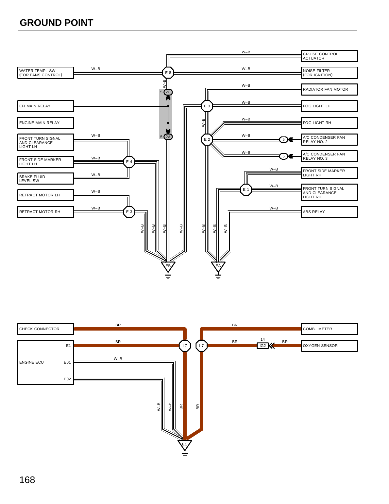

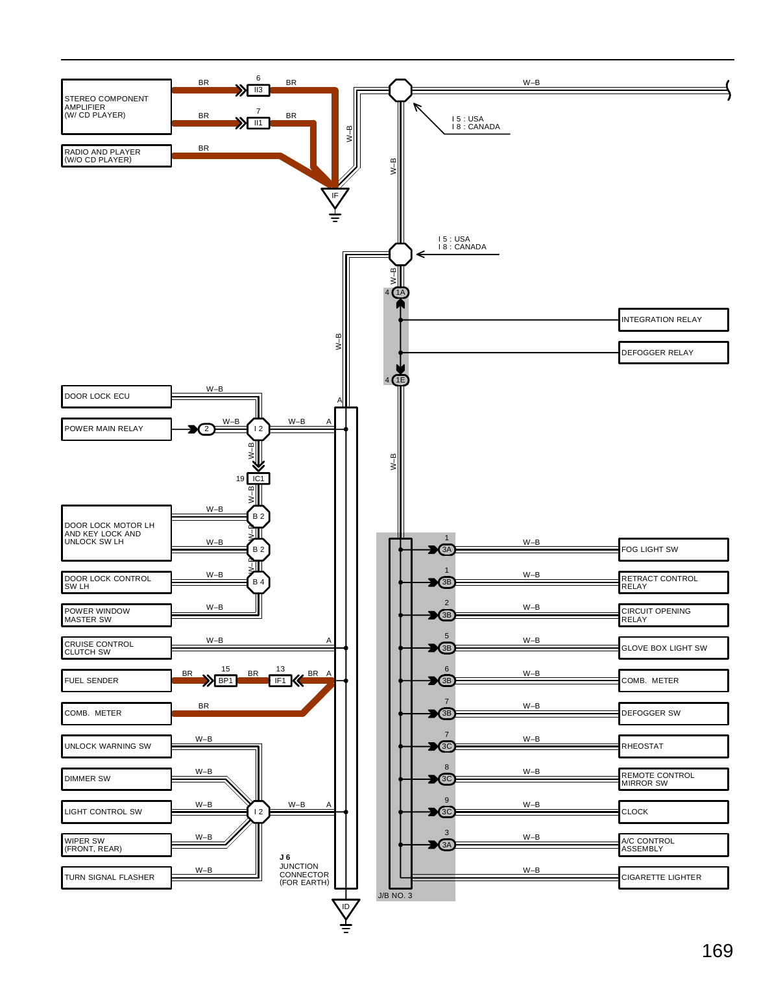

| Code | Where | Keep? | Add? |
|---|---|---|---|
| **EA** | Right front fender | Yes — lights / fans on that side | Bond uprated fan grounds here |
| **EB** | Left front fender | Yes | Bond EPS pump ground **or** use the engine-block stud (preferred for 60 A) |
| **EC** | Intake manifold | Yes, leftover OEM engine-wire grounds | Do not put EPS / fan current on EC |
| **ID** | Left kick panel | Yes | Strap from PDB (L8) |
| **IE / IF** | Dash braces | Yes | Untouched |
| **IG** | R/B No.4 set bolt | Yes | Strap from PDB (R5) |

### 5.6 Deleted OEM circuits — do not restore

| Circuit | Connectors / feeds | Why |
|---|---|---|
| ABS actuator | A7, A8; 60A FL ABS; ABS relays A11/A12 | Module removed; space reused for EPS cables |
| ABS ECU / rear sensors (body) | A38, A39, A40, A41 | Wheel-speed, if kept, goes to the Link VR conditioners on A/B, not the OEM ABS ECU |
| ABS deceleration sensor | A37 | Deleted with ABS |
| SRS airbag / crash sensors | Center airbag sensor (dash, EWD p.17); yellow cowl airbag harness | Deleted. Do not refeed 7.5A IGN into the airbag ECU |
| OEM EFI main / circuit opening / OEM ECU | J/B2 EFI fuse, R/B5 fuel-pump relay, C7 | Replaced by Link `k_efi` / `k_fp` |
| OEM radiator / condenser fan relays in J/B2 and R/B5 | R/B5 fan relays 2 and 3; J/B2 RDI FAN relay | Replaced by `k_fan` / `k_fan2` |

R/B No.5 (engine-bay front right) can stay as a **horn-only** island if you would rather not spend a PMU pin on the horn. Otherwise unplug it and let PMU O3 drive HAZ-HORN at 2E-3, which already feeds the horn relay coil bus.

### 5.7 New Engine Room C runs (the only new bay wiring)

Routed with the OEM engine-room main. Passenger fender / ABS trough for EPS; core support for fans.

| # | Circuit | AWG | Path | Connector |
|---|---|---|---|---|
| C1 | EPS pump 12 V | 8 AWG | `k_eps` 87 (glove box) → passenger kick / EA1 → ABS trough → pump | `90980-12068` pin 1 (OWNED) |
| C2 | EPS pump GND | 8 AWG | Pump pin 2 → engine-block stud (not EA) | `90980-12068` pin 2 |
| C3 | EPS enable | 18 AWG | F13 7.5 A IG-switched → same trough | `90980-10942` pin 1 (OWNED) |
| C4 | EPS relay request | 18 AWG | Pump connector B pin 6 → `k_eps` 85 | Already in Signal as `w_mrs_relay_req` |
| C5 | EPS speed | 18 AWG shielded | Pump connector B pin 2 → Aux 7 / A27 | Signal file, engine harness A — **not** C |
| C6 | Rad fan 12 V | 8 AWG (size to the fan; OEM was 30 A FL) | `k_fan` 87 → core support | New DT 2-way at the fan |
| C7 | Rad fan GND | 8 AWG | Fan → EA | |
| C8 | Condenser fan 12 V | 8 AWG | `k_fan2` 87 → core support | New DT 2-way |
| C9 | Condenser fan GND | 8 AWG | Fan → EA | |
| C10 | A/C compressor clutch | — | **Engine harness A/B**, not C | Already drawn |

Wiper, washer, headlights, turn, park, horn motors **stay on the OEM engine-room loom**. We only restore their power at J1–J5.

---

## 6. What lives in which drawing

Updated 2026-09-22. The two-file Power/Signal split this table used to name is gone;
see `docs/harness/README.md` for the current file map.

| File | Owns |
|---|---|
| `docs/harness/rebuild/ST185-B-ECU.harness` | Cabin fuse block, EFI / ETB / FP / start relays, ECU 12 V, RADLOK cabin side, injector / coil 12 V |
| `docs/harness/rebuild/ST185-A-ECU.harness` | ECU-A sensors and switch inputs |
| `docs/harness/rebuild/ST185-B-engine.harness` | EPS speed, ETB, injector / coil 12 V on the engine side |
| `docs/harness/rebuild/ST185-EngineRoom-C.harness` | **Loom C:** trunk → PDB → PMU, RADLOK, OEM injection blocks, EPS power, uprated fans |
| `docs/harness/legacy-prebuild/ST185-{Power,Signal}.harness` | Frozen pre-split baseline. Read-only, kept only for `verify_rebuild.py` |
| This document | Splice table and factory citations. No second current-flow diagram of the OEM loom |

`bh_c` (HDP20 9-way) **is deleted** — confirmed 2026-09-22, zero references in any
harness file. Fans and EPS do not cross a signal bulkhead.

---

## 7. Sources

| Manual | Pub. | Why it is here |
|---|---|---|
| 1990 Celica All-Trac/4WD Electrical Wiring Diagram | ST185-only EWD (168 p.) | All-Trac J/B, F11, ABS, grounds, IE1/EA1. Snips above. |
| 1992 Celica Electrical Wiring Diagram | EWD132U | Covers ST185; year-adjacent to 1993. Same J/B No.1 / No.2 / kick-panel layout with All-Trac callouts. |
| 1993 Celica EWD160U | Dealer 265 p. book | The All-Trac pages of this book are the year-exact match. The public PDF labelled EWD160U is the **FWD** AT180/ST184 book — do not mix its J/B2 pin numbers into this table. |
| ECUMaster PMU-16 manual / pinout v1.1 | — | 10×25 A + 6×15 A, 150 A total, parallel rule |

On-car check before first power-up: with J/B2 unplugged and the battery still isolated, ohmmeter from each row's cavity to the named load (headlight, dome, ignition I9-4 / I9-10, J/B1 1I-1). Write the measured colour next to the table if it differs.

---

## 8. Glove-box fuse / feed schedule (replaces F11 + J/B2 mains)

TE `2141029-1` already owns F1–F13 in `ST185-Power.harness` (EFI, pump, ETB, start, fans, EPS, ECU +12, coils, injectors, EPS enable). The PDB next to it adds the **body** feeds this document restores:

| Fuse / device | Rating | Replaces | Lands on |
|---|---|---|---|
| AM1 | 40 A | F11 40A FL AM1 | IE1-10 (L6) |
| AM2 | 30 A | F11 30A FL AM2 | IE1-17 (L7) |
| OEM HOT | 40–60 A | FL ALT feed into J/B1 | 1I-1 (L1) |
| HEATER feed | unfused stub; 40 A lives in R/B4 | FL ALT → E13 → R/B4 | R/B4 fuse pins 1–2 (R1) |
| POWER feed | unfused stub; 30 A lives in R/B2 | FL ALT → I2 → R/B2 | R/B2 fuse pins 1–2 (L9) |
| PMU-16 M6 | ANL / mega 150 A (or PMU's own input fuse) | J/B2 HEAD/HAZ/DOME/RTR fuses | PMU stud |
| Charge / start | none at PDB, or ANL 200 A | F11 100A FL ALT | RADLOK + → starter B+ |
| ABS | **omit** | F11 60A FL ABS | deleted |

Heater and POWER keep their OEM fuses in the kick-panel R/Bs. We only restore the always-hot into those fuse **inputs**.

---

## 9. Execution order

1. Photograph and label every J/B2 / F11 / ABS / crash-sensor connector **before** unplugging. Pull the 2A / 2D / 2E plugs and write the wire colour of each cavity on the table.
2. Continuity-map §5.4.1 (2E-2/3 vs IE1) and L1 (1I-1 → battery + on the stock car) while the factory battery is still in the bay, then disconnect it.
3. Unplug F11, 2A–2E, 2B, 2C. Remove ABS actuator, ABS relays, crash-sensor connectors. Do not cut the engine-room main, cowl or dash looms.
4. Trunk battery, cabin-floor 2 AWG / 1/0, glove-box PDB, TE fuse block, PMU-16, remaining relays. RADLOK through the firewall. Jump lugs at trunk, PDB, starter, block, bay post.
5. Inject L1, L6, L7, L8, L9, R1, R5. Isolate R2 (OEM starter relay). Do not land J3/J4 until the probe in step 2 says so.
6. Dummy-header J1 / J2 / J5 (HEAD LH/RH + DOME) along the passenger fender / ABS trough / EA1. Jumper 2A-3↔2D-2 and 2A-6↔2D-6.
7. Engine Room C add-ons: EPS 8 AWG in the vacated ABS trough; uprated fans 8 AWG on the core support. A/C clutch stays on A/B.
8. Power-up: PDB only → 1I-1 lights J/B1 STOP/ECU-B/DEFOGGER → AM1/AM2 crank the ignition switch → PMU enable → headlights / dome. Starter last.

Loom C is `docs/harness/rebuild/ST185-EngineRoom-C.harness`, live on harness.design.
Cabin ECU power is in `rebuild/ST185-B-ECU.harness`.

**Closed 2026-09-22:** the leftover `bh_c` bulkhead and the ETB / injector / coil
12 V wires that were still drawn on it have been reassigned to A/B pins and `bh_c`
is gone from every harness file. Nothing here is blocked on it any more.

---

## 10. Open conflict with plan 6.43 — how much does the PDU own?

Raised 2026-09-22. **Not resolved. Do not build the kick-panel feeds until it is.**

Plan 6.43 says the PDU "owns most internal low-power and accessory circuits."
Section 3.1 of this document says the opposite for a specific list: wiper, gauge,
turn, CIG, ECU-IG, IGN, STOP, TAIL, ECU-B and DEFOGGER all **stay as J/B No.1
fuses**, and heater blower and power windows/locks stay in R/B No.4 and R/B No.2.

Those are exactly the circuits 6.43 describes. Both cannot be right.

### The channel arithmetic decides it

PMU-16 has **16 outputs** — 10 × 25 A and 6 × 15 A.

| Committed | Channels |
|---|---|
| HEAD LH, HEAD RH, HAZ-HORN, DOME, RTR (§3.1) | 5 |
| TrackCluster, CSB3, RealDash Pi (plan 6.38) | 3 |
| Battery-kill relay coil (plan 6.43) | 1 |
| **Used** | **9** |
| **Free** | **7** |

J/B No.1 alone carries about ten circuits. **They do not fit in seven channels**,
before anything is left spare. So 6.43's "most" cannot mean all of them, and this
document's list cannot survive untouched either.

### The options

- **A. Keep 3.1 as written.** J/B No.1 and both R/Bs stay on OEM fusing; the PDU
  owns only the five body channels plus the three CAN devices and the kill coil.
  Cheapest, keeps the OEM fuse layout the EWD documents, leaves 7 channels spare.
- **B. Move a chosen few.** Pick the circuits that gain something real from CAN
  control or soft-start — headlight dimming, defogger timeout, wiper park — and
  leave the rest on OEM fuses. Needs a named list and a channel budget.
- **C. Delete J/B No.1.** Everything to the PDU. Does not fit in one PMU-16 and
  would need a second unit or a fused sub-block, so this is a buy decision, not a
  wiring one.

Until Daniel picks, §3.1 stands as the working assumption, because it is the one
that is fully specified and fits the hardware.
